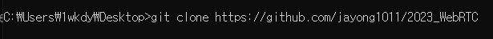

# 실습결과 및 평가서 제출
- 이메일: 20181612@edu.hanbat.ac.kr 
- 파일이름: 학번_이름_평가지

# **프로젝트 소개** #
2023 캡스톤 작품을 활용한 실습 및 아이디어 논의
- 자료 (한글파일)공학설계입문 평가지(Web_Server) 작성 

# [개인] 실습(환경세팅) #
1. 터미널 접속 후 명령어 입력 git clone https://github.com/jayong1011/2023_WebRTC  
 
   ## 터미널 접속방법 ##
   1. 그림에서 cd Desktop 입력
    - 

   2. 그림처럼 바탕화면 경로에서 git clone 명령어 실행
    -  
   

2. Visual Studio Code 실행
   

3. 복제한 git repository 불러오기
   1. Visual Studio Code에서 폴더 열기 클릭 후 바탕화면에 있는 2023_WebRTC 불러오기 
      1. 
    
   
4. Visual Studio Code에서 터미널 - 새 터미널 클릭
   1. 
   2. 

   3.  명령어 입력
   
   4.  명령어 입력
   
   5.  명령어 입력

   6.  명령어 입력
   

# 실습1 [서버 동작 및 결과예시] #
1. 서버 동작확인

  - signaling.py 실행
  -  

  - 크롬에서 주소창에 localhost:8080/class 입력 
  -  실행 결과 확인

2. 실습1 진행
   - signaling.py 파일에 표시한 부분 코드 수정
   - 
   - 수정하고 저장 url창 새로고침 후 결과 확인
  
3. 실습2 진행
   - sample.html 파일에서 표시한 부분 코드 수정하여 아래 결과예시의 그림처럼 자신의 학번을 출력
   - 
   - 정상적으로 출려된 화면 캡쳐하여 평가지에 입력 
  
   - 결과 예시
   - 
 
# [조별]아이디어 논의 
1. ## 최대 동시접속자 1000명을 수용할 수 있는 실시간 스트리밍 서비스를 만들고 싶다. 
   1. ### 위의 제시한 서비스를 만들기 위해 서버에서 고려해야 할 것
   2. ### 이 서비스를 만들기 위해 생기게 되는 문제점과 해결방안

   
